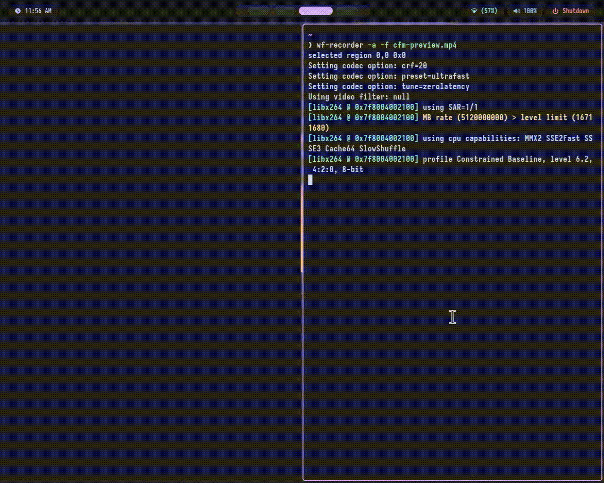
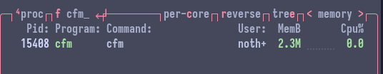

<p align="center">
  
</p>

<h1 align="center">CFM</h1>

<p align="center">
A lightweight terminal file manager written in C.
</p>

<p align="center">
Focused on performance, low resource usage, and keyboard-driven navigation.
</p>

<p align="center">


</p>

## Project 

CFM is a lightweight terminal file manager written entirely in C. It is designed with a strong focus on performance, low memory consumption, and minimal CPU usage while providing an efficient keyboard-driven workflow.

---

## Take a Look!



it supports renaming folders and files but I forgot to feature that 😅

---

## It's lightweight, I swear



---

## Requirements

- Ncurses
- GCC
- pkg-config

---

## Features

- Lightweight and efficient
- Low memory usage
- Keyboard-driven interface
- Fast startup

Core functionality includes:

- Browse directories
- Open files
- Create files and directories
- Delete files and directories
- Rename files and directories

- Optimized for keyboard navigation to maximize productivity.
    - q/Escape: Exit
    - a: Create a new file/folder
    - d: Delete a file/folder
    - r: Rename a file/folder
    - Left Arrow/Enter: Enter a folder or open a file
    - Right Arrow: Go back

---

## Installation

You can install CFM using the provided installation script:

```bash
curl https://raw.githubusercontent.com/nothingfr87/cfm/refs/heads/main/install.sh | sh
```

Alternatively, you can build CFM from source.

Before that let's install the required libraries

```bash
sudo apt update
sudo apt install build-essentials pkg-config libncurses5-dev libncursesw5-dev
```

#### Fedora Distros

```bash
sudo dnf groupinstall "Development Tools"
sudo dnf install ncurses-devel pkgconf-pkg-config
```

#### Arch Distros

```bash
sudo pacman -S base-devel ncurses pkgconf
```

Clone the repository and build the project:

```bash
git clone https://github.com/nothingfr87/cfm.git
cd cfm/

make build
```

The compiled binary will now be available in the project directory.

To install CFM system-wide:

```bash
sudo make all install
```

---

## Supported OS:

Currently supported:

- Linux (Tested on Debian 13 Trixie)
- MacOS (Not Tested)

---

## Issues:

If you encounter any bugs or unexpected behavior, please open an issue. Feedback and contributions are always appreciated.

---

## License

This project is licensed under the [MIT License](LICENSE)

---

### Other Projects:

If CFM does not fit your workflow, you may also be interested in these excellent terminal file managers that inspired this project:

- [Yazi](https://yazi-rs.github.io/)
- [NNN](https://github.com/jarun/nnn)
- [Ranger](https://github.com/ranger/ranger)

---

If you find CFM useful, consider starring the repository to support its development.
