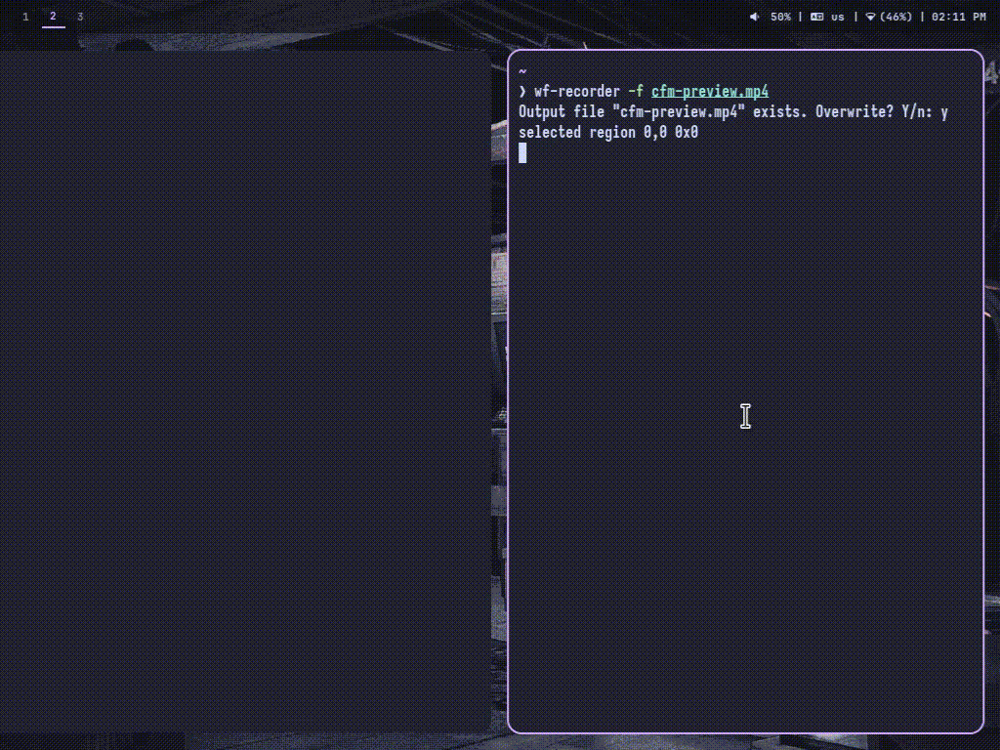

# CFM

C File Manager is just a simple file manager

---

## Description

CFM is a simple TUI file manager fully written in C focusing on performance, and memory & cpu usage

---

## Take a Look!



it supports renaming folders and files but I forgot to feature that 😅

---

## It's lightweight, I swear


---

## Requirements

- Ncurses (TUI)
- GCC (Compiler)

---

## Features

- Lightweight

And just like any file manager:

- Open Files/Folders
- Create Files/Folders
- Delete Files/Folders

- Focused on keyboard keybinds which makes it faster to use
    - q/Escape: Exit
    - a: Create a new file/folder
    - d: Delete a file/folder
    - r: Rename a file/folder
    - Left Arrow/Enter: Enter a folder or open a file
    - Right Arrow: Go back

---

## Installation

Installing CFM is very easy

Before that let's install the required libraries

```bash
sudo apt update
sudo apt install build-essentials  libncurses5-dev libncursesw5-dev
```

#### Fedora Distros

```bash
sudo dnf groupinstall "Development Tools"
sudo dnf install ncurses-devel
```

#### Arch Distros

```bash
sudo pacman -S base-devel ncurses
```

Clone the repo , and build the source code

```bash
git clone https://github.com/nothingfr87/cfm.git
cd cfm/

make build
```

Now you have the binary you can do anything you want with it!

To install CFM on your PC

```bash
sudo make all install
```

On Windows, I don't know how to install binaries so you'll have to build the source code then move the binary file to a safe place then add that folder to your PATH environment

---

## Supported OS:

CFM Supports:

- Linux (Tested on Debian 13 Trixie)

---

## Issues:

Please consider reporting in [Issues](https://github.com/nothingfr87/cfm/issues) if you faced any problems, to help this project get better and better

---

## License

This project is licensed under the [MIT License](LICENSE)

---

### Other Projects:

If you don't like CFM, I am sorry I'll try to make it better!

But for now here some other projects that you would like, these projects inspired me to make this!

- [Yazi](https://yazi-rs.github.io/)
- [NNN](https://github.com/jarun/nnn)
- [Ranger](https://github.com/ranger/ranger)

---

Please consider giving a star if you liked the project, it would be great :)
