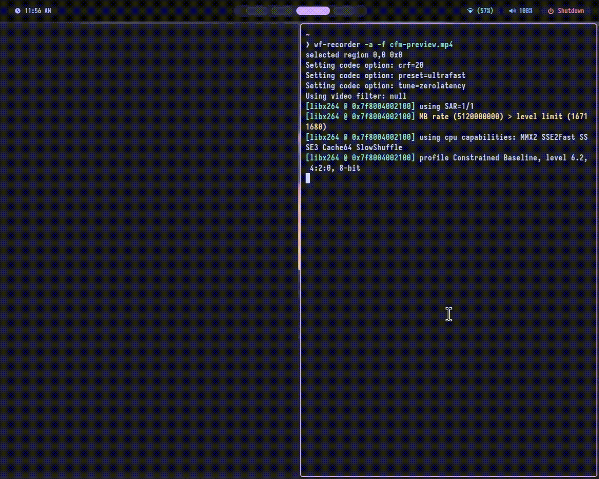
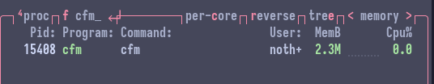

<p align="center">
      
</p>

<h1 align="center">CFM</h1>

<p align="center">
    A lightweight terminal file manager written in C.
</p>

<p align="center">
    Focused on performance, low resource usage, and keyboard-driven navigation.
</p>

<p align="center">
  
  
</p>

## Project 

CFM is a lightweight terminal file manager written entirely in C. It is designed with a strong focus on performance, low memory consumption, and minimal CPU usage while providing an efficient keyboard-driven workflow.

---

## Take a Look!



---

## Performance



---

## Requirements

- Ncurses
- fd (If not installed, search feature won't work)
- GCC
- pkg-config

---

## Features

- Lightweight and efficient
- Low memory usage
- Keyboard-driven interface
- Fast startup
- Image preview (Currently for kitty terminal only)

Core functionality includes:

- Browse directories
- Open files
- Create files and directories
- Delete files and directories
- Rename files and directories
- Copying and Pasting files and directories
- Moving files and directories

- Optimized for keyboard navigation to maximize productivity, powered with vim keys.

CFM uses an internel clipboard for processes like copying, moving and pasting

---

## Usage

CFM is optimized for keyboard navigation to maximize productivity powered with vim keys

| Key(s) | Function |
| ------ | -------- |
| <kbd>h</kbd> <kbd>Enter</kbd> <kbd>Left Arrow</kbd> | Go Back (Parent Directory) |
| <kbd>l</kbd> <kbd>Right Arrow</kbd> | Enter Directory |
| <kbd>j</kbd> <kbd>Down Arrow</kbd> | Navigate to the bottom |
| <kbd>k</kbd> <kbd>Up Arrow</kbd> | Navigate to the top |
| <kbd>gg</kbd>| Move to the top |
| <kbd>G (Shift + G)</kbd>| Move to the bottom |
| <kbd>c</kbd> <kbd>y</kbd> | Copy a file/folder |
| <kbd>x</kbd> | Cut a file/folder |
| <kbd>p</kbd>| Paste a file/folder |
| <kbd>s</kbd> <kbd>/</kbd>| Search a file |
| <kbd>q</kbd> <kbd>Esc</kbd> | Quit CFM |
| <kbd>a</kbd> | Create a new file/folder |
| <kbd>d</kbd> | Delete a file/folder |
| <kbd>r</kbd> | Rename a file/folder |

---

## Installation

You can install CFM using the provided installation script:

```bash
curl https://raw.githubusercontent.com/nothingfr87/cfm/refs/heads/main/install.sh | sh
```

Alternatively, you can build CFM from source.

Before that let's install the required libraries

```bash
sudo apt update
sudo apt install build-essentials pkg-config libncurses5-dev libncursesw5-dev
```

#### Fedora Distros

```bash
sudo dnf groupinstall "Development Tools"
sudo dnf install ncurses-devel pkgconf-pkg-config
```

#### Arch Distros

```bash
sudo pacman -S base-devel ncurses pkgconf
```

Clone the repository and build the project:

```bash
git clone https://github.com/nothingfr87/cfm.git
cd cfm/

make build
```

The compiled binary will now be available in the project directory.

To install CFM system-wide:

```bash
sudo make all install
```

---

## Supported OS:

Currently supported:

- Linux (Tested on Debian 13 Trixie)
- MacOS (Not Tested)

---

## Issues:

If you encounter any bugs or unexpected behavior, please open an issue. Feedback and contributions are always appreciated.

---

## License

This project is licensed under the [MIT License](LICENSE)

---

### Other Projects:

If CFM does not fit your workflow, you may also be interested in these excellent terminal file managers that inspired this project:

- [Yazi](https://yazi-rs.github.io/)
- [NNN](https://github.com/jarun/nnn)
- [Ranger](https://github.com/ranger/ranger)

---

## Special Thanks

| [rida-hdj](https://github.com/rida-hdj) | making our CFM Logo |
| --------- | ---------- |
| [DEXTER](https://github.com/abod8639) | Adding image preview for kitty terminal |


---

If you find CFM useful, consider starring the repository to support its development.
